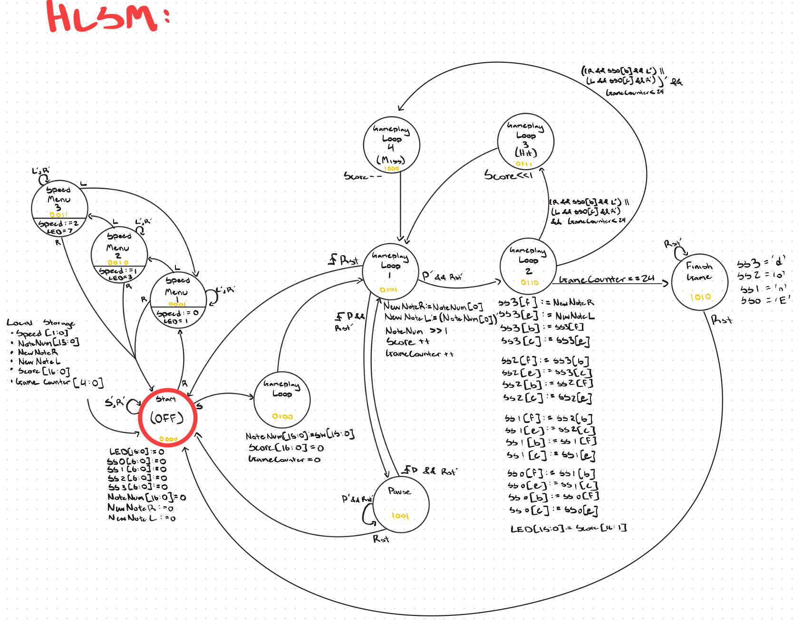
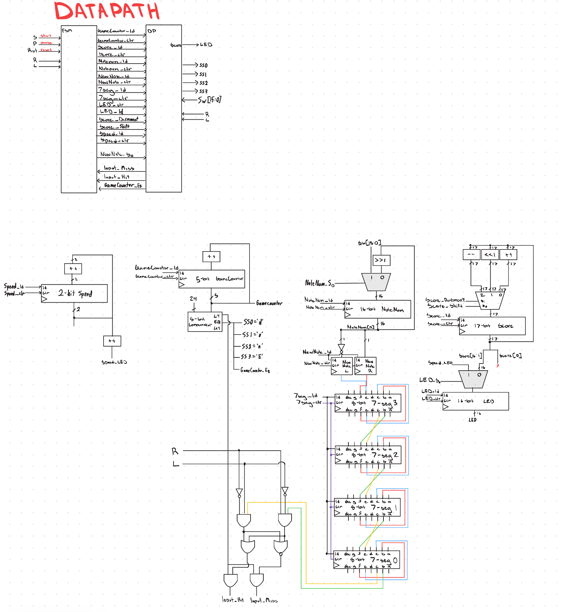

# Taiko Drum

A Verilog implementation of the classic Japanese arcade rhythm game *Taiko no Tatsujin* (太鼓の達人, "Master of the Taiko"), built for the Xilinx Artix-7 FPGA on a Basys 3 board.

Notes scroll down the four-digit seven-segment display — the board is mounted rotated 90°, so the display reads vertically. When a lit segment reaches the bottom, press the matching button to score.

## Demo

## How to Play

The game boots into a menu. From there:

| Button | Menu | In game |
| --- | --- | --- |
| **Right** | Enter speed menu | Right |
| **Left** | Toggle speed level (3 settings) | Left |
| **Up** | Start game | — |
| **Center** | — | Pause / resume |
| **Down** | Reset | Reset |

Custom rhythm maps can be authored with the on-board switches before starting a round.

## Design

The controller was specified as a formal FSM and refined into an HLSM before RTL implementation. The final design is an 11-state controller driving a scoring datapath, coordinating note timing windows, hit/miss detection, and score accumulation.

Supporting hardware:

- **Parameterized clock divider** — selectable game speeds from a single divider module
- **Time-multiplexed display driver** — refreshes the 4-digit seven-segment display
- **Debounced pushbutton input** — clean edge detection for hit registration
- **Switch-based pattern entry** — user-authored rhythm maps

### Documentation






## Repository Layout

```
Taiko_Drum.srcs/
  sources_1/new/     Verilog source modules
  sim_1/new/         Testbenches
  constrs_1/         Basys 3 constraints (.xdc)
Taiko_Drum.xpr       Vivado project file
```

### Modules

| File | Purpose |
| --- | --- |
| `taiko_main.v` | Top-level module |
| `gameStateMachine.v` | 11-state game controller |
| `gameCounter.v` | Note timing and position tracking |
| `score.v` | Score accumulation |
| `noteNum.v` | Note pattern generation |
| `speed.v` | Speed level selection |
| `clk_select.v` | Clock source multiplexing |
| `dynamicClkDiv.v` | Parameterized clock divider |
| `rising_edge_detector.v` | Button debounce / edge detection |
| `sevenSeg.v`, `sevenSeg_display.v` | Display encoding and refresh |
| `led.v` | LED indicators |

## Build

Open `Taiko_Drum.xpr` in Vivado, then run synthesis, implementation, and generate the bitstream. Program the Basys 3 over USB via the Hardware Manager.

Testbenches for gameplay, scoring, and the speed menu are under `Taiko_Drum.srcs/sim_1/new/`.
